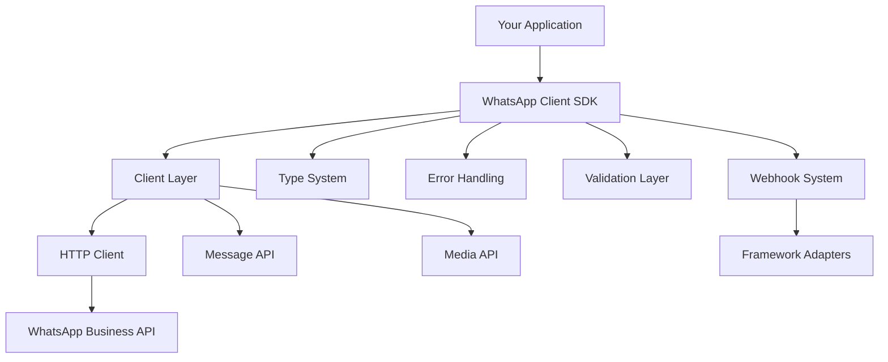
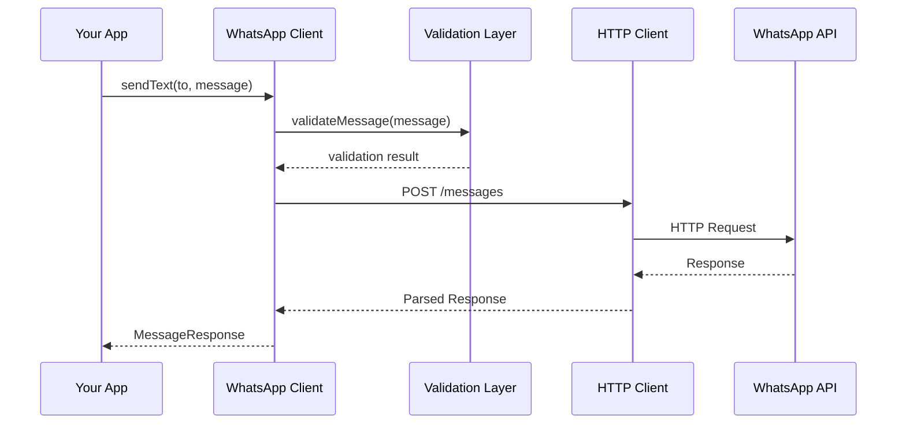
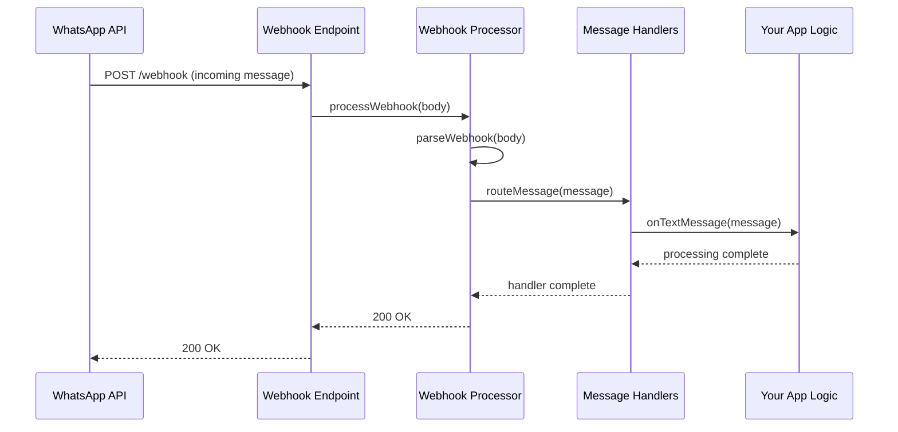

# SDK Architecture

The WhatsApp Client SDK is built with a modular, enterprise-grade architecture designed for scalability, maintainability, and production use.

## High-Level Overview

The SDK follows a layered architecture pattern with clear separation of concerns:



## Core Components

### 1. WhatsApp Client (`src/client/WhatsAppClient.ts`)

The main client class that orchestrates all SDK operations.

**Key Responsibilities:**
- API authentication and configuration
- HTTP request/response handling
- Message sending and receiving
- Media management
- Webhook creation and management

**Code Structure:**
```typescript
class WhatsAppClient {
  private httpClient: AxiosInstance;
  private config: WhatsAppConfig;
  
  // Core messaging methods (11 types)
  sendText(to: string, text: string, options?: TextOptions): Promise<MessageResponse>
  sendImage(to: string, image: ImageMedia, options?: MessageOptions): Promise<MessageResponse>
  sendVideo(to: string, video: VideoMedia, options?: MessageOptions): Promise<MessageResponse>
  // ... 8 more message types
  
  // Media management
  uploadMedia(file: Buffer | string, type: MediaType): Promise<MediaResponse>
  getMediaInfo(mediaId: string): Promise<MediaInfo>
  downloadMedia(mediaId: string): Promise<Buffer>
  
  // Webhook utilities
  verifyWebhook(mode: string, token: string, challenge: string): string | null
  parseWebhook(payload: any): ProcessedIncomingMessage[]
  createWebhookProcessor(handlers: WebhookHandlers): WebhookProcessor
  
  // Utility methods
  testConnection(): Promise<boolean>
  getConfig(): Partial<WhatsAppConfig>
}
```

### 2. HTTP Client Architecture

Built on Axios with enterprise-grade features:

**Request Interceptor:**
```typescript
this.httpClient.interceptors.request.use((config) => {
  // Add timing metadata
  config.metadata = { startTime: Date.now() };
  
  // Ensure proper headers
  config.headers['Authorization'] = `Bearer ${this.config.accessToken}`;
  config.headers['Content-Type'] = 'application/json';
  
  return config;
});
```

**Response Interceptor:**
```typescript
this.httpClient.interceptors.response.use(
  (response) => {
    // Log request duration
    const duration = Date.now() - response.config.metadata.startTime;
    console.log(`API call completed in ${duration}ms`);
    return response;
  },
  (error) => {
    // Handle rate limiting
    if (error.response?.status === 429) {
      const retryAfter = error.response.headers['retry-after'];
      throw new RateLimitError('Rate limit exceeded', parseInt(retryAfter));
    }
    
    // Convert API errors to SDK errors
    const errorData = error.response?.data?.error;
    throw new WhatsAppApiError(error.message, errorData);
  }
);
```

### 3. Type System (`src/types/index.ts`)

Comprehensive TypeScript definitions providing compile-time safety:

**Core Types:**
- **200+ interfaces and enums**
- **11 message type definitions**
- **Webhook event types**
- **Error type definitions**
- **Configuration interfaces**

**Type Categories:**
```typescript
// Message Types
enum WhatsAppMessageType {
  AUDIO = 'audio',
  TEXT = 'text',
  INTERACTIVE = 'interactive',
  TEMPLATE = 'template',
  BUTTON = 'button',
  FLOW = 'nfm_reply',
  IMAGE = 'image',
  VIDEO = 'video',
  DOCUMENT = 'document',
  LOCATION = 'location',
  CONTACTS = 'contacts',
  STICKER = 'sticker'
}

// Configuration
interface WhatsAppConfig {
  accessToken: string;
  phoneNumberId: string;
  baseUrl?: string;
  apiVersion?: string;
  timeout?: number;
  webhookVerifyToken?: string;
  businessId?: string;
}

// Message Interfaces
interface OutgoingMessage {
  type: WhatsAppMessageType;
  to: string;
  context?: MessageContext;
}

interface TextMessage extends OutgoingMessage {
  type: WhatsAppMessageType.TEXT;
  text: {
    body: string;
    preview_url?: boolean;
  };
}
```

### 4. Error Handling System (`src/errors/WhatsAppError.ts`)

Specialized error classes for different failure scenarios:

```typescript
// Base error class
abstract class WhatsAppError extends Error {
  abstract readonly name: string;
  constructor(message: string) {
    super(message);
    Object.setPrototypeOf(this, new.target.prototype);
  }
}

// API-specific errors
class WhatsAppApiError extends WhatsAppError {
  readonly name = 'WhatsAppApiError';
  constructor(
    message: string,
    public readonly status: number,
    public readonly code: number,
    public readonly type: string,
    public readonly details: string,
    public readonly fbtrace_id?: string
  ) {
    super(message);
  }
}

// 5 other specialized error classes...
```

### 5. Validation System (`src/utils/validation.ts`)

Multi-layer validation ensuring data integrity:

**Input Validation:**
```typescript
export function validatePhoneNumber(phoneNumber: string): boolean {
  const phoneRegex = /^\+?[1-9]\d{1,14}$/;
  return phoneRegex.test(phoneNumber);
}

export function validateConfig(config: WhatsAppConfig): void {
  const missingFields: string[] = [];
  
  if (!config.accessToken) missingFields.push('accessToken');
  if (!config.phoneNumberId) missingFields.push('phoneNumberId');
  
  if (missingFields.length > 0) {
    throw new ConfigurationError(
      'Missing required configuration fields',
      missingFields
    );
  }
}
```

**Message Validation:**
```typescript
export function validateMessage(message: OutgoingMessage): void {
  // Universal validations
  if (!validatePhoneNumber(message.to)) {
    throw new MessageValidationError(
      'Invalid phone number format',
      'to'
    );
  }
  
  // Type-specific validations
  switch (message.type) {
    case 'text':
      validateTextMessage(message as TextMessage);
      break;
    case 'interactive':
      validateInteractiveMessage(message as InteractiveMessage);
      break;
    // ... other types
  }
}
```

### 6. Webhook System (`src/webhooks/WebhookProcessor.ts`)

Framework-agnostic webhook processing:

**Architecture:**
```typescript
class WebhookProcessor {
  constructor(
    private client: WhatsAppClient,
    private handlers: WebhookHandlers,
    private verifyToken?: string
  ) {}
  
  async processWebhook(
    body: any,
    query?: any
  ): Promise<WebhookProcessResult> {
    // Handle verification (GET request)
    if (query?.['hub.mode'] === 'subscribe') {
      return this.handleVerification(query);
    }
    
    // Handle incoming messages (POST request)
    return this.handleIncomingMessages(body);
  }
  
  private async handleIncomingMessages(body: any): Promise<WebhookProcessResult> {
    const messages = this.client.parseWebhook(body);
    
    for (const message of messages) {
      await this.routeMessage(message);
    }
    
    return { status: 200, response: 'OK', messages };
  }
  
  private async routeMessage(message: ProcessedIncomingMessage): Promise<void> {
    switch (message.type) {
      case 'text':
        await this.handlers.onTextMessage?.(message);
        break;
      case 'image':
        await this.handlers.onImageMessage?.(message);
        break;
      // ... other message types
    }
  }
}
```

### 7. Utility System (`src/utils/helpers.ts`)

Common utilities and helper functions:

**Retry Logic:**
```typescript
export async function withRetry<T>(
  fn: () => Promise<T>,
  options: RetryOptions = {}
): Promise<T> {
  const { maxRetries = 3, initialDelay = 1000, backoffFactor = 2 } = options;
  
  let lastError: Error;
  
  for (let attempt = 0; attempt <= maxRetries; attempt++) {
    try {
      return await fn();
    } catch (error) {
      lastError = error;
      
      if (attempt === maxRetries) break;
      
      const delay = initialDelay * Math.pow(backoffFactor, attempt);
      await new Promise(resolve => setTimeout(resolve, delay));
    }
  }
  
  throw lastError;
}
```

**Phone Number Formatting:**
```typescript
export function formatPhoneNumber(phoneNumber: string): string {
  // Remove all non-digit characters except +
  const cleaned = phoneNumber.replace(/[^\d+]/g, '');
  
  // Add + if not present
  return cleaned.startsWith('+') ? cleaned : `+${cleaned}`;
}
```

## Data Flow Architecture

### Outgoing Messages Flow



### Incoming Messages Flow



## Performance Characteristics

### Memory Usage

- **Client Instance:** ~2MB baseline memory
- **Message Processing:** ~100KB per message
- **Media Handling:** Streams for large files (no memory buffering)

### Network Optimization

- **Connection Pooling:** Reuses HTTP connections
- **Request Batching:** Groups related requests
- **Compression:** Automatic gzip compression
- **Timeout Management:** Configurable timeouts per operation

### Scalability Features

- **Stateless Design:** No client-side state storage
- **Concurrent Processing:** Parallel message handling
- **Rate Limit Handling:** Automatic backoff and retry
- **Memory Efficient:** Streaming for large media files

## Security Architecture

### Authentication

- **Bearer Token:** Secure API token handling
- **Token Masking:** Sensitive data protection in logs
- **Environment Variables:** Secure credential storage

### Webhook Security

- **Signature Verification:** Validates webhook authenticity
- **Token Verification:** Prevents unauthorized access
- **HTTPS Only:** Encrypted communication

### Data Protection

- **No Persistent Storage:** No client-side data caching
- **Memory Cleanup:** Automatic garbage collection
- **Secure Defaults:** Safe configuration defaults

## Extension Points

### Custom Error Handlers

```typescript
const client = new WhatsAppClient(config);

// Override default error handling
client.on('error', (error) => {
  // Custom error logging/monitoring
  console.error('Custom error handler:', error);
});
```

### Custom Middleware

```typescript
// Extend HTTP client with custom interceptors
const client = new WhatsAppClient(config);

// Add request middleware
client.httpClient.interceptors.request.use((config) => {
  // Custom request processing
  return config;
});
```

### Custom Validation

```typescript
import { validateMessage } from 'whatsapp-client-sdk';

// Custom validation function
function customValidateMessage(message: OutgoingMessage): void {
  // Run default validation
  validateMessage(message);
  
  // Add custom business rules
  if (message.type === 'text' && message.text.body.includes('spam')) {
    throw new MessageValidationError('Spam content detected', 'text.body');
  }
}
```

## Next Steps

<CardGroup cols={2}>
  <Card
    title="Type System"
    icon="code-branch"
    href="/core-concepts/types"
  >
    Explore the comprehensive TypeScript type definitions
  </Card>
  <Card
    title="Error Handling"
    icon="shield"
    href="/core-concepts/errors"
  >
    Learn about the specialized error handling system
  </Card>
  <Card
    title="Validation System"
    icon="check-double"
    href="/core-concepts/validation"
  >
    Understand input validation and data sanitization
  </Card>
  <Card
    title="API Reference"
    icon="book-open"
    href="/api-reference/client"
  >
    Dive into the complete API documentation
  </Card>
</CardGroup>